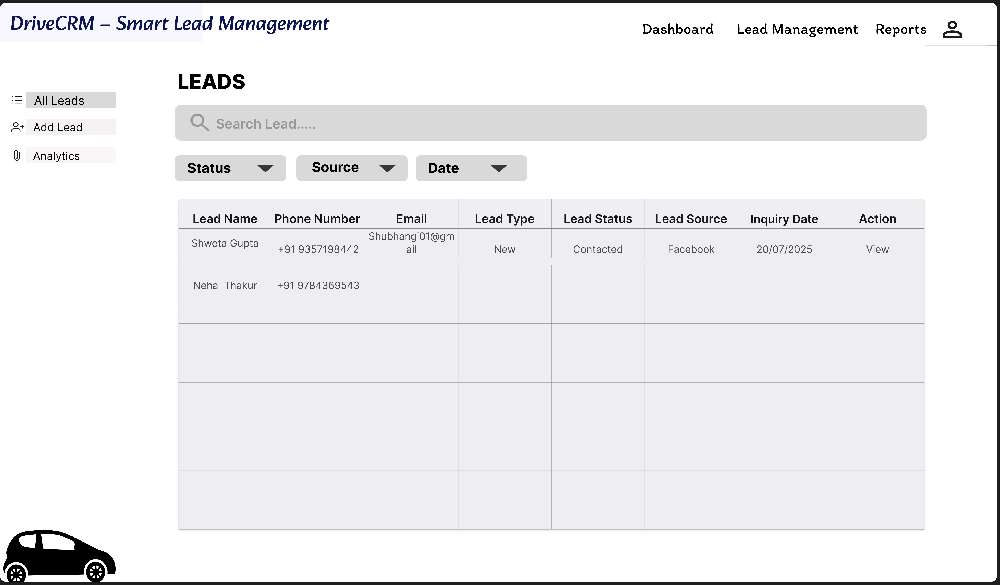

# DriveCRM - Lead Management System

A modern and intuitive desktop CRM application designed to help automotive sales teams efficiently manage customer leads and drive higher conversions.



## 🎯 Project Overview

**DriveCRM** is a centralized lead management solution created to replace manual spreadsheet processes with a clean, user-friendly system. The goal was to create an efficient workflow that sales teams actually enjoy using.

## ✨ Core Objectives

- Streamline lead capture and tracking
- Improve team collaboration and visibility
- Provide clear performance insights through visual dashboards
- Reduce missed follow-ups and lost opportunities

## 🖥️ Designed Interfaces

- **Lead Listing Screen** – Clean overview with smart filtering and search
- **Lead Details View** – Comprehensive customer information at a glance
- **Lead Management Panel** – Quick actions, status updates & reminders
- **Analytics Dashboard** – Visual performance tracking for managers

## 🎨 Design Focus

- Prioritized clarity and ease of use for power users (sales representatives)
- Consistent and polished UI components
- Clear visual hierarchy and intuitive navigation
- Emphasis on reducing cognitive load while managing high volumes of leads

## 🔑 Key Features Designed

- Priority tagging system for leads
- Automated follow-up tracking
- Sales performance visualization
- Lead source analytics
- Simple and fast status management

## 📊 Project Impact (Target Outcomes)

- Faster lead response time
- Improved lead-to-sale conversion
- Better visibility into team performance
- More structured and data-driven sales process

## 🎨 Figma Prototype

**[View Interactive Figma Prototype](https://www.figma.com/design/YZePW3Nkz71nt5Tr0uGNER/DriveCRM-%E2%80%93-Smart-Lead-Management-System--Copy-?node-id=0-1&t=INnwrl9OR07juL9Z-1)**

## 📂 Repository Structure

```bash
drivecrm-lead-management/
├── DriveCRM_Product_Assignment.pdf
├── README.md
└── assets/
    ├── dashboard.png
    ├── lead-listing.png
    ├── lead-details.png
    └── lead-management.png
👤 About the Author
Jayavardhan Bhogi
Business & IT Student | Berlin, Germany
Passionate about Product Design, UI/UX, and building intuitive digital tools that solve real business problems.
text---

You can copy the entire content above and paste it into your `README.md` file.

Would you like a **shorter version** or a **more design-focused** version?
